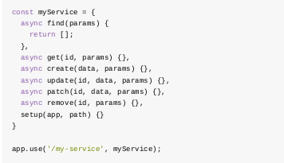

FeathersJS
===

**I. FeathersJS là gì?** 
  * FeathersJS là mẫu kiến trúc và bộ công cụ được tạo ra để hỗ trợ dựng REST APIs và ứng dụng thời gian thực.
  * Nó có 2 thành phần chính là Service và Hook:
    * Service là các adapter dùng để cài đặt nên các phương thức CRUD cho server
    * 
    * Sau khi đã đăng ký, ta có thể sử dụng các service này thông qua app.service()
    * 
    * Hook có thể được chạy trước hoặc sau khi thực hiện service, ta có thể dùng Hook để xử lý nội dung request trước khi pass cho service và response mà service trả ra
  ---
**II. Tương tác database với FeathersJS**
  * FeathersJS cung cấp bộ database adapter để cài đặt các thao tác query cơ bản tới database.
  * Các loại database FeathersJS hỗ trợ wrapper:
    * In memory: feathers-memory, feathers-nedb
    * Localstorage: feathers-localstorage
    * FileSystem: feathers-nedb
    * MongoDB: feathers-mongodb, feathers-mongoose
    * MySQL,	PostgreSQL,	MariaDB,	SQLite,	MSSQL: feathers-knex, feathers-sequelize
    * ElasticSearch: feathers-elasticsearch
    * RethinkDB: feathers-rethinkdb
  * Ngoài ra, người dùng có thể tự dựng adapter tương tác với database ngoài những db kể trên thông qua Service
  * Cách sử dụng database wrapper:
    * Thêm package feathers wrapper của database muốn sử dụng như bản trên
    * Khai báo database và model cần sử dụng (Lưu ý, với từng loại database khác nhau, cách cài đặt có thể sẽ khác nhau)
    * Thiết đặt Model cho service là Model của database vừa khai báo
    * Chạy app
    * Có thể sử dụng các api tương tác với database một cách bình thường với các phương thức REST phù hợp:
    * | **API** | **REST method** |
      |:----:|:-----------:|
      |Create| Post        |
      |Find (Get all)| Get |
      |Get one| Get (with id)|
      |Patch (update)| Patch |
      |Remove| Delete      |
  * Ta có thể sử dụng hook để customize các API, hooks sẽ nhận được biến context. Biến context gồm có các param read-only và các param writeable:
    * Read-only:
      * context.app - The Feathers application object
      * context.service - service mà hook được cài đặt
      * context.path - đường dẫn của service
      * context.method - phương thức của service
      * context.type - The hook type (*before*, *after* or *error*)
    * Writeable:
      * context.params - thường chứa:
        * context.params.query - câu query đính chung với request
        * context.params.provider - dịch vụ mà app đang sử dụng để gửi nhận request
      * context.id - item id nếu request là get/remove/update/patch
      * context.data - data gửi kèm nếu request là create/update/patch
      * context.error - nội dung lỗi khi sử dụng để bắt lỗi request, chỉ sử dụng được trong *error*
      * context.result - kết quả sau khi thực hiện service, chỉ sử dụng được trong *after*
    * Cấu trúc của hooks:
    * *
    * Luồng của hooks:
    * 
    * Ví dụ sử dụng hooks để validate data cho các request:
    * 
**III. Dùng tính năng auto generate của FeathersJS để tạo app đơn giản**
  * Cài đặt gói generator của feathers
  * 
  * Generate app bằng dòng lệnh:
  * 
  * Generator sẽ hỏi bạn một số thứ như tên project, mô tả, tên thư mục chứa source, dùng npm hay yarn, loại API muốn tạo...
  * 
  * Sau khi chạy xong, ta có được mã nguồn vừa tạo:
    * hooks/ : chứa các custom hooks
    * middleware : chứa các middleware của Express nếu có
    * service : chứa các service
    * index.js : load app
    * app.js : config feathers app
    * app.hooks.js : chứa các hooks global (áp dụng với mọi service)
    * channels.js : cài event channel cho feathers app
  * Ta sẽ generate service cho feathers app:
  * 
  * Chọn loại database wrapper muốn sử dụng
  * 
  * Ở đây ta sẽ dựng service cho MongoDB, sau đó generator sẽ hỏi tên service muốn tạo, ta có thể hiểu đó là resource ta muốn tương tác với database. Ta sẽ dựng một app đơn giản thêm sản phẩm mới vào kho dành cho nhân viên nhập liệu của shop thời trang.
  * Đầu tiên ta sẽ tạo service *user* để cài authentication cho các API
  * 
  * Một service mới được tạo trong source của app
  * 
  * Tương tự ta tạo service *products*
  * Ta thêm xác thực cho app
  * 
  * Ta chọn phương thức xác thực là username + password, entity sử dụng cho việc authen là service user đã tạo ở trên
  * 
  * Để tất cả API tương tác với products được authen trước khi thực hiện, ta sửa lại hooks của products
  * 
  * Để demo 1 custom hook, ta giả sử mỗi khi tạo mới 1 sản phẩm, db sẽ lưu lại thời gian tạo của nó
  * Ta thêm vào hooks custom cho *product*
  * 
  * Ta sẽ phải xác định tên hook, loại hook (before/after/error), cài đặt hook này cho service nào, cho API nào
  * 
  * Ta sửa nội dung của hook trong file add-created-date.js vừa được tạo
  * 
  * Ta sẽ dựng phần front-end cho app (Sửa file index.html trong public/ mà feathers cung cấp)
  * 
  * Javascript của frontend có cấu trúc như sau:
  * 
  * Ta sử dụng socket.io để handle phần real-time (Lưu ý: nếu app front-end ta dựng tách rời so với back-end, ta cần xác định server backend cho socket )
  * Biến products là service sẽ được sử dụng
  * 
  * Các API (find, get, create, update, patch, remove) có thể được gọi thông qua product.
  * Tạo products:
  * 
  * Giờ ta muốn mỗi khi thêm mới một sản phẩm, danh sách ở client sẽ tự động lấy và cập nhật lại thì phải làm sao? Ta sẽ lắng nghe trên các message thay đổi tương ứng 
  * Lúc này mỗi khi có API nào đã thực hiện thành công làm thay đổi db thì danh sách của client sẽ cập nhật lại

Video demo app: https://youtu.be/fTCk3gGOUo8

---
**Hết**