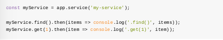

 FeathersJS 

===
  ---
**I. FeathersJS là gì?** 
  * FeathersJS là mẫu kiến trúc và bộ công cụ được tạo ra để hỗ trợ dựng REST APIs và ứng dụng thời gian thực.
  * Nó có 2 thành phần chính là Service và Hook:
    * Service là các adapter dùng để cài đặt nên các phương thức CRUD cho server
    * 
    * Sau khi đã đăng ký, ta có thể sử dụng các service này thông qua app.service()
    * 
    * Hook có thể được chạy trước hoặc sau khi thực hiện service, ta có thể dùng Hook để xử lý nội dung request trước khi pass cho service và response mà service trả ra
  ---
**II. Tương tác database với FeathersJS**
  * FeathersJS cung cấp bộ database adapter để cài đặt các thao tác query cơ bản tới database.
  * Các loại database FeathersJS hỗ trợ wrapper:
    * In memory: feathers-memory, feathers-nedb
    * Localstorage: feathers-localstorage
    * FileSystem: feathers-nedb
    * MongoDB: feathers-mongodb, feathers-mongoose
    * MySQL,	PostgreSQL,	MariaDB,	SQLite,	MSSQL: feathers-knex, feathers-sequelize
    * ElasticSearch: feathers-elasticsearch
    * RethinkDB: feathers-rethinkdb
  * Ngoài ra, người dùng có thể tự dựng adapter tương tác với database ngoài những db kể trên thông qua Service
  * Cách sử dụng database wrapper:
    * Thêm package feathers wrapper của database muốn sử dụng như bản trên
    * Khai báo database và model cần sử dụng (Lưu ý, với từng loại database khác nhau, cách cài đặt có thể sẽ khác nhau)
    * Thiết đặt Model cho service là Model của database vừa khai báo
    * Chạy app
    * Có thể sử dụng các api tương tác với database một cách bình thường với các phương thức REST phù hợp:
      | **API** | **REST method** |
      |:----:|:-----------:|
      |Create| Post        |
      |Find (Get all)| Get |
      |Get one| Get (with id)|
      |Patch (update)| Patch |
      |Remove| Delete      |
  * Ta có thể sử dụng hook để customize các API, hooks sẽ nhận được biến context. Biến context gồm có các param read-only và các param writeable:
    * Read-only:
      * context.app - The Feathers application object
      * context.service - service mà hook được cài đặt
      * context.path - đường dẫn của service
      * context.method - phương thức của service
      * context.type - The hook type (*before*, *after* or *error*)
    * Writeable:
      * context.params - thường chứa:
        * context.params.query - câu query đính chung với request
        * context.params.provider - dịch vụ mà app đang sử dụng để gửi nhận request
      * context.id - item id nếu request là get/remove/update/patch
      * context.data - data gửi kèm nếu request là create/update/patch
      * context.error - nội dung lỗi khi sử dụng để bắt lỗi request, chỉ sử dụng được trong *error*
      * context.result - kết quả sau khi thực hiện service, chỉ sử dụng được trong *after*
    * Cấu trúc của hooks:
    * 
    * Luồng của hooks:
    * 
    * Ví dụ sử dụng hooks để validate data cho các request:
    * 